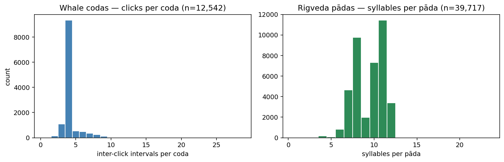
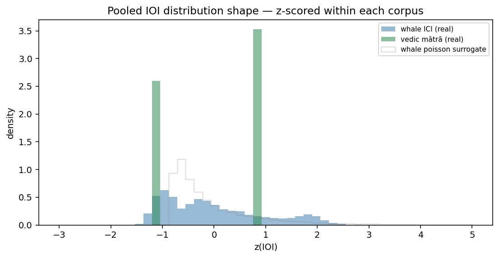
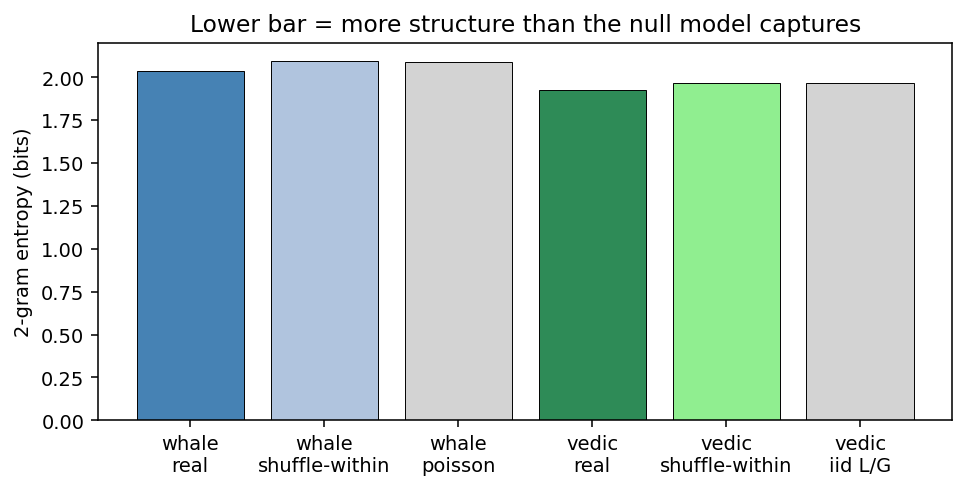

# Sperm Whale Perspective

A reproducible structural comparison of sperm whale codas and Rigvedic meter.

## Motivation

> *Drafted in Dr. Zijing's first-person voice for him to edit. The metaphysical
> framing here is the author's interpretive worldview that motivated the
> investigation; it is not a finding of the analysis.*

I have spent a long time sitting with two ideas at once. The first is that
sperm whales — the largest brains on Earth, organisms whose entire existence
unfolds inside a sustained acoustic medium — are doing something with their
codas that we have not yet learned to listen to as language. The second is
that the Rigveda, recited continuously for more than three thousand years
along strict syllabic and tonal rules, encodes a discipline of attention and
breath that the Vedic tradition itself describes as cosmological. Both
traditions, in different vocabularies, treat patterned sound as a way the
world arranges itself. What I am personally curious about is whether some
trace of that arrangement — a rhythmic regularity, a tendency to organise
duration the same way — is detectable when you look at the two corpora side
by side, with no a priori interpretive scaffolding.

This repository is the most honest first step I could take toward that
question. It does not attempt to translate codas, to assign meanings to
clicks, or to argue that whales recite verse. It compares timing and
sequence statistics, with structure-destroying null models on each side, and
asks only whether the *shape* of one corpus's structural fingerprint
resembles the other's more than each resembles its own randomised version.
The Vedic tradition deserves to be engaged on its own terms, not flattened
into a metaphor; and the whales deserve the same. **The analysis below tests
structural resonance only and makes no claims about meaning or
consciousness.**

## What this repo contains

- `notebooks/01_whale_data.ipynb` — ingestion of the AUTEC sperm-whale
  acoustic events (Tongue of the Ocean, 2007) and the CETI / Sharma et al.
  2024 coda corpus; basic spatial and per-coda summaries.
- `notebooks/02_vedic_data.ipynb` — TEI XML parse of the VedaWeb Rigveda,
  programmatic derivation of laghu/guru weights and meter labels per
  syllable, distributional summaries.
- `notebooks/03_comparison.ipynb` — full structural comparison: pooled IOI
  distributions, n-gram entropy, lag-k autocorrelation, all evaluated on
  real corpora and on three null-model surrogate variants per side, with
  KS and chi-square tests and Cohen's d.
- `notebooks/04_results.ipynb` — three headline plots and the verdict for
  non-technical readers.
- `src/swp/` — feature extraction (`features.py`), surrogate generators and
  tests (`stats.py`), schema constants (`io.py`), Vedic parser (`vedic.py`).

## Data

See [`data/README.md`](data/README.md) for per-source provenance, citations,
and licenses. Raw files are gitignored — reproduce via the download
instructions there. Processed parquet files are committed.

## Methods

Outlined in [`docs/DESIGN.md`](docs/DESIGN.md) §7. In one paragraph:

For each corpus we extract the same family of structural features —
inter-onset interval (IOI) distributions, sequence-length histograms,
lag-k autocorrelations, and 2-/3-gram entropies — discretising whale
inter-click intervals into per-coda quantile bins and using the Vedic
weight alphabet (L, G) directly. We generate three null-model surrogate
variants per corpus: shuffle within sequences (preserves multiset and
length, destroys position-specific structure), shuffle across sequences
(preserves global frequencies and length distribution, destroys per-sequence
identity), and a Poisson / i.i.d. variant matching the first moment only.
The cross-corpus comparison z-scores within each corpus first so that the
question is one of distribution shape, not of absolute units (seconds vs
mātrās). Statistical tests: two-sample Kolmogorov–Smirnov on pooled IOIs,
chi-square on n-gram counts, Cohen's d for effect size. We treat all
results as exploratory and report effect sizes alongside p-values.

## Headline results

The corpus sizes — 12,559 whale codas (54,944 inter-click intervals) versus
374,897 Vedic syllables across 39,717 pādas — are sample-size-asymmetric
but ample for distributional tests. Three observations:



Whale codas are short (median 5 clicks per coda) and tightly distributed.
Rigvedic pādas cluster around the canonical 8- and 11-syllable meters
(gāyatrī, triṣṭubh, jagatī).



After z-scoring within each corpus, the *shape* of the pooled IOI
distribution differs substantially across the two corpora (whale ICIs are
right-skewed; Vedic mātrā durations are bimodal-by-construction). The
Kolmogorov–Smirnov distance between the two real distributions is
**D = 0.374** — larger than each corpus's distance to its own structure-
destroying null (whale↔poisson D = 0.224; Vedic↔i.i.d.-L/G D = 0.000 by
construction).



Both corpora *do* show meaningful internal structure: real 2-gram entropy
is below all surrogate variants by ~0.04–0.06 bits in each corpus, and
chi-square tests reject the null at p < 1e-300 for every real-vs-surrogate
comparison (whale χ² up to 4 028; Vedic χ² up to 16 446). The structure is
real, and it is corpus-specific.

**Verdict: no structural resonance detected beyond what surrogate sequences
produce.** The z-scored pooled-IOI distance between real whale codas and
real Rigvedic pādas exceeds the worst real-vs-non-trivial-surrogate
distance within either corpus. The two distributions differ in shape by
more than each corpus differs from its own structure-destroying nulls. Each
corpus contains real internal structure (n-gram entropy is significantly
below surrogate baselines), but that structure does not align across
corpora at the level of the features we measured.

This is the credible scientific outcome of the question we asked. It does
not falsify Dr. Zijing's broader interpretive thesis — only the very narrow
quantitative version of "structural resonance" tested here.

## Limitations

- **Structural-only.** No attempt at semantic decoding, translation, or
  mapping between coda inventories and Vedic units. The features measured
  are timing and sequence statistics only.
- **No human-language control corpus.** A natural extension would compare
  *both* corpora against a third (English speech, birdsong, music) to
  separate "structure of patterned sound generally" from corpus-specific
  signals. Cut for the weekend timeline; a known weakness, not a hidden
  one.
- **AUTEC contribution is the open Samples subset.** The AUTEC 2007
  hydrophone deployment recorded ~675 sperm-whale acoustic events; the
  publicly hosted Samples export at OBIS-SEAMAP dataset 682 contains 49 of
  those events, used here only for the location/timestamp context shown in
  notebook 01. The structural comparison runs on the CETI / Sharma 2024
  coda corpus.
- **Apophenia.** With ~50,000 IOIs on one side and ~375,000 on the other,
  any test will be powerful enough to detect arbitrarily small differences;
  effect sizes (Cohen's d, KS D) are reported throughout for that reason.
  The verdict above is read off effect sizes, not p-values.
- **Sample-size asymmetry.** Distributional tests handle this; paired tests
  would not, and we do not run any.

## How to reproduce

```bash
git clone https://github.com/zzj0402/Sperm-Whale-Perspective
cd Sperm-Whale-Perspective
uv sync
# Download raw data per data/README.md, then:
jupyter nbconvert --to notebook --execute --inplace notebooks/*.ipynb
```

All processed parquet files (~2 MB total) are committed, so notebook 03 and
04 — the comparison and headline-results notebooks — re-execute against the
committed inputs without requiring the raw downloads.

## License

- Code: MIT (see `LICENSE`).
- Prose, figures, and processed data: CC-BY-4.0, derived from CC-licensed
  upstream sources. See `data/README.md` for per-source attribution.

## Acknowledgments

- **Dr. Zijing** (`zzj0402`) — principal investigator and author of the
  motivating thesis.
- **Project owner** (this fork) — engineering and analysis contributor.
- **AI assistance** — the analysis pipeline, surrogate-test framework, and
  prose drafts in this repository were built with Claude (Anthropic) acting
  in a multi-agent execution role under human direction. Outputs were
  reviewed by the project owner before commit.

### Citations

- Sharma, P., Gero, S., Payne, R. *et al.* "Contextual and combinatorial
  structure in sperm whale vocalisations." *Nat Commun* **15**, 3617 (2024).
  Data: Zenodo `10.5281/zenodo.10817697`.
- DECAF — AUTEC Sperm Whales — Multiple Sensors — Complete Dataset. OBIS-
  SEAMAP dataset 682 (2010). https://seamap.env.duke.edu/dataset/682
- VedaWeb. *A Web-Based Platform for the Analysis of Vedic Sanskrit Texts.*
  Cologne Center for eHumanities, University of Cologne.
  https://github.com/VedaWebProject/vedaweb-data

For Dr. Zijing's longer-form thesis, see [`docs/MOTIVATION.md`](docs/MOTIVATION.md)
(stub; expanded essay forthcoming).
